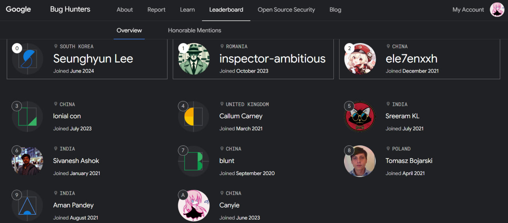

A 20 y.o. sophomore (also a former secondary vocational school student) from China.

Blog: https://blog.canyie.top/
<!-- 
Telegram channel: [@CanyieChannel](https://t.me/CanyieChannel) -->

Bugs & Vulnerabilities: 
- Android: contributed to [CVE-2024-0044](https://nvd.nist.gov/vuln/detail/CVE-2024-0044) ([PoC & writeup](https://github.com/canyie/CVE-2024-0044)), [CVE-2024-31318](https://nvd.nist.gov/vuln/detail/CVE-2024-31318), [CVE-2024-43080](https://nvd.nist.gov/vuln/detail/CVE-2024-43080), [CVE-2024-43081](https://nvd.nist.gov/vuln/detail/CVE-2024-43081), [CVE-2024-43088](https://nvd.nist.gov/vuln/detail/CVE-2024-43088), [CVE-2024-43090](https://nvd.nist.gov/vuln/detail/CVE-2024-43090), [CVE-2024-43762](https://nvd.nist.gov/vuln/detail/CVE-2024-43762), [CVE-2024-49733](https://nvd.nist.gov/vuln/detail/CVE-2024-49733), [CVE-2024-49741](https://nvd.nist.gov/vuln/detail/CVE-2024-49741), [CVE-2024-49744](https://nvd.nist.gov/vuln/detail/CVE-2024-49744), [CVE-2025-0100](https://nvd.nist.gov/vuln/detail/CVE-2025-0100)

(This list may be out of sync. Search "canyie" in [Android acknowledgements](https://source.android.com/docs/security/overview/acknowledgements) for all!)

Acknowledgements & Rankings:
- As of 2025/01/01 I am currently ranked #55 in the world on the entire [Google Bug Hunters platform](https://bughunters.google.com/profile/3497d4e9-5612-4155-a861-dd1f97509949), #11 in the 2024 year, and #10 in the entire Android Program.
- Nickname "canyie" on [Android Security Acknowledgements](https://source.android.com/docs/security/overview/acknowledgements), [Google Bug Hunters Leaderboard](https://bughunters.google.com/leaderboard), and [Xiaomi Security Center](https://sec.xiaomi.com/#/hero)

<!--
Discussion Group:
- QQ Group: 949888394
- Telegram Group: [@DreamlandFramework](t.me/DreamlandFramework)
-->
<!-- What are you trying to seek out? -->

Disclaimer: Although I'm a member of LSPosed Team, all repositories hosted by this account are owned by myself. They are maintained by me alone and have no affiliation with the LSPosed team nor are they part of the LSPosed community.

<!--
**canyie/canyie** is a ✨ _special_ ✨ repository because its `README.md` (this file) appears on your GitHub profile.

Here are some ideas to get you started:

- 🔭 I’m currently working on ...
- 🌱 I’m currently learning ...
- 👯 I’m looking to collaborate on ...
- 🤔 I’m looking for help with ...
- 💬 Ask me about ...
- 📫 How to reach me: ...
- 😄 Pronouns: ...
- ⚡ Fun fact: ...
-->
