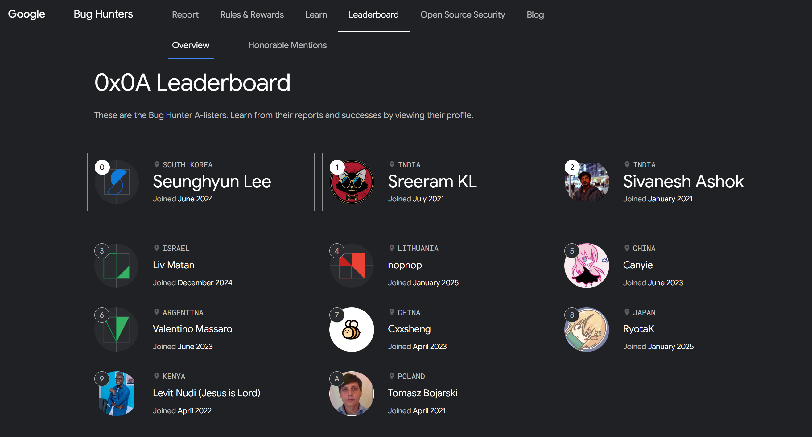

A 21 y.o. sophomore (also a former secondary vocational school student) from China. **Expected to be unavailable in a short period due to health issues.**

Blog: https://blog.canyie.top/
<!-- 
Telegram channel: [@CanyieChannel](https://t.me/CanyieChannel) -->

Research Outputs (such as papers, presentations, etc.):
- [Parcel Mismatch Demystified: Addressing a Decade-Old Security Challenge in Android](https://dl.acm.org/doi/10.1145/3719027.3765034)  
*The 32nd ACM Conference on Computer and Communications Security (ACM CCS 2025)*
- Parcel Mismatch - The History, Mitigation and Vulnerabilities    *Google bugSWAT Mexico City 2025 (Closed-Door Conference)*
- [VsyncBreaker: Subverting Screen Trust via State Disruption and ONE-WAY Flooding](https://blackhat.com/asia-26/briefings/schedule/#vsyncbreaker-subverting-screen-trust-via-state-disruption-and-one-way-flooding-50006)   *BlackHat Asia 2026*

Also see my blog which contains many informal research articles.

Acknowledgements & Rankings:
- As of 2026/04/14 I am currently ranked #19 in the world on the entire [Google Bug Hunters platform](https://bughunters.google.com/profile/3497d4e9-5612-4155-a861-dd1f97509949), #7 in the 2024 year, #6 in the 2025 year, and #5 in the entire Android Program. I'm also the champion of the Android Vulnerability Reward Program in 2025, see my name in [Google VRPs in Review – 2025](https://bughunters.google.com/blog/google-vrps-in-review-2025#android-devices)!
- Nickname "canyie" on [Android Security Acknowledgements](https://source.android.com/docs/security/overview/acknowledgements), [Google Bug Hunters Leaderboard](https://bughunters.google.com/leaderboard), [Xiaomi Security Center](https://sec.xiaomi.com/#/hero), [Huawei Bug Bounty Program](https://bugbounty.huawei.com/hbp/#/ranking), [Huawei Security Acknowledgement](https://consumer.huawei.com/en/support/acknowledgment/), and [Samsung Mobile Security](https://security.samsungmobile.com/main.smsb)

Bugs & Vulnerabilities (including independently discovered and those I have contributed to): 
- Android & Google Devices: contributed to [CVE-2021-39787](https://nvd.nist.gov/vuln/detail/CVE-2021-39787), [CVE-2024-0044](https://nvd.nist.gov/vuln/detail/CVE-2024-0044) ([PoC & writeup](https://github.com/canyie/CVE-2024-0044)), [CVE-2024-31318](https://nvd.nist.gov/vuln/detail/CVE-2024-31318), [CVE-2024-43080](https://nvd.nist.gov/vuln/detail/CVE-2024-43080), [CVE-2024-43081](https://nvd.nist.gov/vuln/detail/CVE-2024-43081), [CVE-2024-43088](https://nvd.nist.gov/vuln/detail/CVE-2024-43088), [CVE-2024-43090](https://nvd.nist.gov/vuln/detail/CVE-2024-43090), [CVE-2024-43762](https://nvd.nist.gov/vuln/detail/CVE-2024-43762), [CVE-2024-49733](https://nvd.nist.gov/vuln/detail/CVE-2024-49733), [CVE-2024-49741](https://nvd.nist.gov/vuln/detail/CVE-2024-49741), [CVE-2024-49743](https://nvd.nist.gov/vuln/detail/CVE-2024-49743), [CVE-2024-49744](https://nvd.nist.gov/vuln/detail/CVE-2024-49744), [CVE-2025-0076](https://nvd.nist.gov/vuln/detail/CVE-2025-0076), [CVE-2025-0100](https://nvd.nist.gov/vuln/detail/CVE-2025-0100), [CVE-2025-22432](https://nvd.nist.gov/vuln/detail/CVE-2025-22432), [CVE-2025-26464](https://nvd.nist.gov/vuln/detail/CVE-2025-26464), [CVE-2025-32323](https://nvd.nist.gov/vuln/detail/CVE-2025-32323), [CVE-2025-36889](https://nvd.nist.gov/vuln/detail/CVE-2025-36889), [CVE-2025-48524](https://nvd.nist.gov/vuln/detail/CVE-2025-48524), [CVE-2025-48535](https://nvd.nist.gov/vuln/detail/CVE-2025-48535), [CVE-2025-48545](https://nvd.nist.gov/vuln/detail/CVE-2025-48545), [CVE-2025-48554](https://nvd.nist.gov/vuln/detail/CVE-2025-48554), [CVE-2025-48569](https://nvd.nist.gov/vuln/detail/CVE-2025-48569), [CVE-2025-48570](https://nvd.nist.gov/vuln/detail/CVE-2025-48570), [CVE-2025-48573](https://nvd.nist.gov/vuln/detail/CVE-2025-48573), [CVE-2025-48575](https://nvd.nist.gov/vuln/detail/CVE-2025-48575), [CVE-2025-48580](https://nvd.nist.gov/vuln/detail/CVE-2025-48580), [CVE-2025-48582](https://nvd.nist.gov/vuln/detail/CVE-2025-48582), [CVE-2025-48611](https://nvd.nist.gov/vuln/detail/CVE-2025-48611), [CVE-2025-48615](https://nvd.nist.gov/vuln/detail/CVE-2025-48615), [CVE-2025-48635](https://nvd.nist.gov/vuln/detail/CVE-2025-48635), [CVE-2025-48645](https://nvd.nist.gov/vuln/detail/CVE-2025-48645), [CVE-2025-48648](https://nvd.nist.gov/vuln/detail/CVE-2025-48648), [CVE-2026-0014](https://nvd.nist.gov/vuln/detail/CVE-2026-0014), [CVE-2026-0039](https://nvd.nist.gov/vuln/detail/CVE-2026-0039), [CVE-2026-0040](https://nvd.nist.gov/vuln/detail/CVE-2026-0040), [CVE-2026-0041](https://nvd.nist.gov/vuln/detail/CVE-2026-0041), [CVE-2026-0042](https://nvd.nist.gov/vuln/detail/CVE-2026-0042), [CVE-2026-0043](https://nvd.nist.gov/vuln/detail/CVE-2026-0043), [CVE-2026-0044](https://nvd.nist.gov/vuln/detail/CVE-2026-0044), [CVE-2026-0049](https://nvd.nist.gov/vuln/detail/CVE-2026-0049), [CVE-2026-0051](https://nvd.nist.gov/vuln/detail/CVE-2026-0051), [CVE-2026-0052](https://nvd.nist.gov/vuln/detail/CVE-2026-0052), [CVE-2026-0067](https://nvd.nist.gov/vuln/detail/CVE-2026-0067), [CVE-2026-0068](https://nvd.nist.gov/vuln/detail/CVE-2026-0068), [CVE-2026-0069](https://nvd.nist.gov/vuln/detail/CVE-2026-0069), [CVE-2026-0079](https://nvd.nist.gov/vuln/detail/CVE-2026-0079), [CVE-2026-0080](https://nvd.nist.gov/vuln/detail/CVE-2026-0080), [CVE-2026-0091](https://nvd.nist.gov/vuln/detail/CVE-2026-0091) ([PoC & writeup](https://github.com/canyie/TransitionPlayer)), [CVE-2026-0098](https://nvd.nist.gov/vuln/detail/CVE-2026-0098), [CVE-2026-28575](https://nvd.nist.gov/vuln/detail/CVE-2026-28575), [CVE-2026-28584](https://nvd.nist.gov/vuln/detail/CVE-2026-28584), [CVE-2026-28585](https://nvd.nist.gov/vuln/detail/CVE-2026-28585), [CVE-2026-28630](https://nvd.nist.gov/vuln/detail/CVE-2026-28630), [CVE-2026-28644](https://nvd.nist.gov/vuln/detail/CVE-2026-28644), [CVE-2026-28666](https://nvd.nist.gov/vuln/detail/CVE-2026-28666), [CVE-2026-49924](https://nvd.nist.gov/vuln/detail/CVE-2026-49924)
- Huawei: [CVE-2025-31175](https://nvd.nist.gov/vuln/detail/CVE-2025-31175), [CVE-2026-41973](https://nvd.nist.gov/vuln/detail/CVE-2026-41973), [CVE-2026-41974](https://nvd.nist.gov/vuln/detail/CVE-2026-41974)
- Samsung: SVE-2025-1890 ([CVE-2026-21014](https://nvd.nist.gov/vuln/detail/CVE-2026-21014))

(This list may be out of sync. Search "canyie" in [Android acknowledgements](https://source.android.com/docs/security/overview/acknowledgements) for all!)

<!--
Discussion Group:
- QQ Group: 949888394
- Telegram Group: [@DreamlandFramework](t.me/DreamlandFramework)
-->
<!-- What are you trying to seek out? -->

Disclaimer: Although I'm a member of LSPosed Team, all repositories hosted by this account are owned by myself. They are maintained by me alone and have no affiliation with the LSPosed team nor are they part of the LSPosed community.

<!--
**canyie/canyie** is a ✨ _special_ ✨ repository because its `README.md` (this file) appears on your GitHub profile.

Here are some ideas to get you started:

- 🔭 I’m currently working on ...
- 🌱 I’m currently learning ...
- 👯 I’m looking to collaborate on ...
- 🤔 I’m looking for help with ...
- 💬 Ask me about ...
- 📫 How to reach me: ...
- 😄 Pronouns: ...
- ⚡ Fun fact: ...
-->
